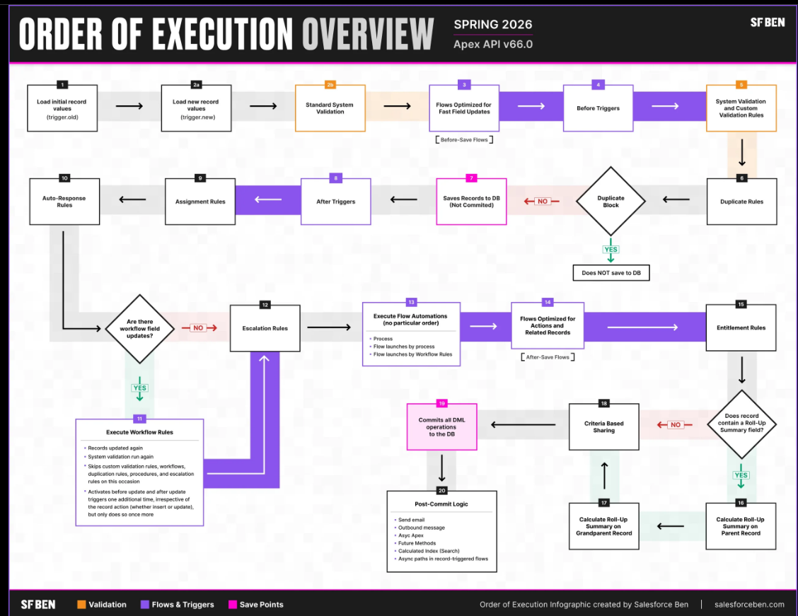

# ORDER OF EXECUTION

---

Building solutions with SF is a fairly easy task, but if I don't go below the surface, my solutions may end up creating unintended  technical debt in my system. This can slow down my org, or worse - I could start to see fatal errors due to hitting the govnr limits.

When saving a record, it goes through a specific sequence of events which is known as the **Salesforce Order of Execution**.

When I save a record with an `insert`, `update`, or `upsert` statement, Salesforce performs a sequence of events in a certain order.

Before Salesforce executes these events on the server, the browser runs JavaScript validation if the record contains any dependent picklist fields. The validation limits each dependent picklist field to its available values. No other validation occurs on the client side before sending the request to the server.

On the serverside, Salesforce performs events in the ***Order of Execution*** (*During a recursive save, Salesforce skips steps 9 (assignment rules) through 17 (roll-up summary field in the grandparent record))

## Salesforce Order of Execution

Whether declaritive, low code, or a coding solution, all are woven together into the *Order of Execution* and affect how my system runs. Whether I'm an admin, developer, or architect, I need to always keep in mind how my new solution is affecting and interacting with the existing org's standard functionality, managed packages, and existing customizations.

## Order of Execution from Developer Docs API v67

1. Loads the original record from the database or initializes the record for an `upsert` statement.
    - *I need to learn what an `upsert` statement is exactly. (the when, why, what, and how)*
2. Loads the new record field values from the request and overwrites the old values
    Salesforce performs different validation checks depending on the type of request as well:
    - For requests from a standard UI edit page, Salesforce runs these system validation checks on the record:
        - Compliance with layout-specific rules
        - Required values at the layout level and field-definition level
        - Valid field formats
        - Maximum field length

    Additionally, if the request is from a *User* object on a standard UI edit page, Salesforce runs custom validation rules
    - For requests from multiline item create such as quote line items and opportunity line items, Salesforce runs custom validation rules. 
    - For requests from other sources such as an Apex application or a SOAP API call, Salesforce validates foreign keys, field formats, maximum field lengths, and restricted  picklists. Before executing a trigger, Salesforce verifies that any custom foreighn keys don't refer to the object itself.
3. Executes record-triggered flows that are configured to run before the record is saved.
4. Then executes all `before` triggers.
5. Runs most system validation steps **again**, such as verifying that all required fields have a non-null value, and runs any custom validation rules. The only system validation that Salesforce doesn't run a second time (when the request comes from a standard UI edit page) is the enforcement of layout-specific rules.
6. Executes duplicate rules. If the duplicate rule identifies the record as a duplicate and uses the block action, the record isn't saved and no further steps, such as `after` triggers and workflow rules, are taken. 
7. Saves the record to the database, ***but doesn't commit it yet.***
8. Executes all `after` triggers.
9. Executes assignment rules.
10. Executes auto-response rules.
11. Executes workflow rules. If there are workflow field updates (only for workflow rules):
    a. Updates the record again.
    b. Runs system validations **again**. Custom validation rules, flows, duplicate rules, processes built with Process Builder, and escalation rules **aren't** run again.
    c. Executes `before update` triggers and `after update` triggers, regardless of the record operation (insert or update), one more time (and only one more time).
12. Executes escalation rules.
13. Executes these Salesforce Flow automations, but not in guaranteed order:
    - Processes built with Process Builder.
    - Flows launched by workflow rules (flow trigger workflow actions pilot)

    When a process or flow executes a DML operation, the affected record goes through the save procedure. 
14. Executes record-triggered flows tha are configured to run after the record is saved.
15. Executes entitlement rules.
16. If the record contains a roll-up summary field or is part of a cross-object workflow (*what's that?* 🤔), performs calculations and updates the roll-up summary field in the parent record. Parent record goes through save procedure. 
17. If the parent record is updated, and a grandparent record contains a roll-up summary field or is part of a cross-object workflow, performs calculations and updates the roll-up summary field in the grandparent. Grandparent record goes through save procedure.
18. Executes Criteria Based Sharing evaluation.
19. Then finally commit all DML operations to the database.
20. After the changes are committed to the database, post-commit logic is executed. Examples of post-commit logic (in no particular order) include:
    - Sending email
    - Enqueued asynchronous Apex jobs, including queueable jobs and future methods
    - Asynchronous paths in record-triggered flows

## Additional Considerations for Triggers:

- If a workflow rule field update is triggered by a record update, `Trigger.old` **doesn't** hold the newly updated field by the workflow after the update.Instead, `Trigger.old` holds the object **before** the initial record update was made. For example, an existing record has a number field with an initial value of 1. A user udpates this field to 10, and a workflow rule field update fires and increments it to 11. In the `update` trigger that fires after the workflow field update, the field value of the object obtained from `Trigger.old` is the **original** value of 1, and not 10. 
- If a DML call is made with partial success allowed, triggers are fired during the first attempt and are fired again during subsequent attempts. Because these trigger invocations are part of the same transaction, static class variables that are accessed by the trigger aren't reset.
- If more than one trigger is defined on an object for the same event, the order of trigger execution ***isn't guaranteed***. For example, if you have two `before insert` triggers for Case and a new Case record is inserted. The firing order of these two triggers isn't guaranteed.
- To learn about the order execution when we insert a non-private contact in our org that associates a contact to multiple accounts, see. [AccountContactRelation](https://developer.salesforce.com/docs/atlas.en-us.262.0.object_reference.meta/object_reference/sforce_api_objects_accountcontactrelation.htm).
- To learn about the order of execution when we're using `before` triggers to set **Stage** and **Forecast Category**, see [Opportunity](https://developer.salesforce.com/docs/atlas.en-us.262.0.object_reference.meta/object_reference/sforce_api_objects_opportunity.htm).
- In API version 53.0 and earlier, after-save record-triggered flows run after entitlements are executed.

---

## Summary

In most orgs, I'll end up with clicks with code, so I need to use the Salesforce Order of Execution to my advantage. Maximizing the success of my solution and my system with these key takeaways:
- The Order of Execution affects ***every*** saved record on the UI or via API
- The order may be different based on the API of my components
- I need to **stay up to date** with each release to see any changes made.