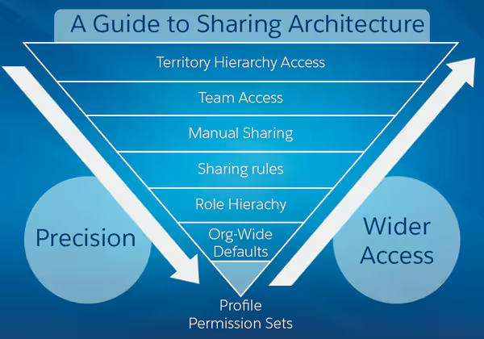

# Session 6 — The Security & Access Model

> **Cert Track:** Platform Administrator I → Nonprofit Cloud Consultant → Platform App Builder → Platform Developer I → Agentforce Specialist → JavaScript Developer I → Platform Developer II → Data Architect → Sharing & Visibility Architect → ***Salesforce Certified Application Architect***

> **Salesforce Admin Cert — Study Guide Series**
> Captured deep-dive session: concept explanations, mental-model clarifications, and a worked quiz with full answer rationale. Read the concepts, then test yourself against the quiz section before reading the graded answers.

**What this guide covers**
- The four layers: Org, Object, Field, Record
- Object permissions (CRUD + View All / Modify All) via Profiles & Permission Sets
- Field-Level Security vs Page Layout (security vs cosmetics)
- The record-access waterfall: OWD → Role Hierarchy → Sharing Rules → Manual → Team → Territory Hierarchy → Apex

- Profiles vs Permission Sets vs Permission Set Groups (the modern shift)
- Public Groups, implicit sharing, and the "most permissive vs most restrictive" rules
- Quiz: 8 exam-style scenarios with full diagnostic rationale

---

## 1. The Core Mental Model: Four Independent Layers

Salesforce security is not one thing — it's four separate mechanisms, each controlling a different dimension. Diagnose any "why can't this user see X" problem by checking each layer separately.

```
LAYER 1 · ORG ACCESS   — can this person log in at all?
        v
LAYER 2 · OBJECT ACCESS — can they see/create/edit/delete this object TYPE?
        v
LAYER 3 · FIELD ACCESS  — can they see/edit this specific FIELD?
        v
LAYER 4 · RECORD ACCESS — can they see/edit this specific RECORD?
```

> **The rule that governs Layers 2–3 vs Layer 4**
> **Object & Field permissions: most permissive wins.** Profile sets a baseline; Permission Sets add on top; permissions are additive upward. **Record access: a restrictive floor (OWD) that only opens wider.** Nothing in the waterfall can restrict below OWD — every mechanism only grants more access.

---

## 2. Layer 1 — Org Access

"Can you get in the door?" — authentication only, nothing about data once inside.
- User record active with a valid license
- Login Hours (org- or profile-level)
- Login IP Ranges (profile-level — blocks login outside range entirely)
- Trusted IP Ranges (org-level — bypasses the MFA challenge, doesn't block login)
- MFA (now required) and SSO

**Exam trap:** Trusted IP Ranges (org, skips MFA challenge) vs Login IP Ranges (profile, blocks login) sound alike and behave very differently.

---

## 3. Layer 2 — Object Access (CRUD + View/Modify All)

| Permission | Meaning |
|---|---|
| Read | View records of this object |
| Create | Create new records |
| Edit | Edit existing records |
| Delete | Delete records |
| **View All** | See ALL records, bypassing record-level security |
| **Modify All** | Edit/delete ALL records, bypassing record-level security |

View All / Modify All bypass the ENTIRE Layer-4 record-access system. Grant sparingly.

### Profiles vs Permission Sets vs Permission Set Groups
- **Profile** — exactly one per user, required. Baseline object perms, FLS, app/tab visibility, login hours/IP, Apex/VF access.
- **Permission Set** — added on top of a Profile; a user can have many. Strictly additive (grants, never removes).
- **Permission Set Group** — a bundle of Permission Sets assigned as one unit.
- **Direction of travel:** Salesforce is moving to a "Profile-lite" model — minimal Profiles, permissions in Permission Sets. **Rule:** baseline for a whole category of user = Profile; anything granular for one user/small group = Permission Set. Never create a new Profile for one person.

---

## 4. Layer 3 — Field-Level Security (FLS)

Controls whether a user can see/edit a specific field, regardless of record access. Three states per field per Profile/Permission Set: Visible+Editable, Visible+Read-Only, Hidden.

> **Page Layout ≠ Field-Level Security (heavily tested)**
> **Page Layout** controls what appears on the record page in the UI — it's cosmetics, NOT security. **FLS** is the real control, enforced everywhere: UI, reports, list views, search, AND the API. Hiding a field on the layout still leaves it reachable via API/reports. To secure a field, use FLS; to declutter the UI, use the layout.

---

## 5. Layer 4 — Record Access (the waterfall)

Of all records of a type the user can touch, WHICH specific ones can they see/edit? Five mechanisms, each only opening access wider than the one below — never narrower.

```
1. ORG-WIDE DEFAULTS (OWD)  — the baseline floor for everyone
        ^  (visibility opens upward from here)
2. ROLE HIERARCHY          — managers see records their subordinates OWN
3. SHARING RULES           — automated exceptions to OWD (owner- or criteria-based)
4. MANUAL SHARING          — owner shares one record with a user/group
5. APEX MANAGED SHARING    — programmatic shares for logic config can't express
```

### Org-Wide Defaults
- Private · Public Read Only · Public Read/Write · Public Read/Write/Transfer (Leads & Cases) · Controlled by Parent (M-D detail objects).
- Best practice = least privilege: start restrictive (often Private), open up selectively.
- Changing OWD on a live org triggers a sharing recalculation — can take hours; do it off-hours.

### Role Hierarchy
- Users higher in the hierarchy automatically see records OWNED by those below them.
- **Key nuance:** it flows OWNERSHIP visibility upward — NOT access. A manager does NOT inherit records merely shared with a subordinate via rules or manual shares.
- "Grant Access Using Hierarchies" checkbox (default on) can be turned off per object.

### Sharing Rules
- **Owner-based:** share records owned by group A with group B.
- **Criteria-based:** share records where a field meets criteria with group B.
- Targets: Public Groups, Roles, Roles & Subordinates, Territories. Grant Read or Read/Write.
- Can only OPEN access — never restrict below OWD; can't grant Full Access.

### Manual Sharing & Apex Managed Sharing
- **Manual:** owner (or Full Access holder) shares one record; only when OWD is Private or Public Read Only; shares often drop on owner change.
- **Apex:** creates records on the object's Share table (AccountShare, etc.) for complex/dynamic logic. Admin exam: know it EXISTS and when config runs out — not how to code it.
- Modern Apex uses explicit sharing declarations: **with sharing / without sharing / inherited sharing** (a security-posture improvement over older defaults).

### Public Groups & implicit sharing
- **Public Group** = a reusable list of users/roles/groups. "Public" = available org-wide to reference, NOT a security level. No private/protected counterpart. It's neutral until USED in a sharing rule, folder share, etc.
- **Implicit sharing (Service Cloud):** when a user owns a Case, Salesforce automatically grants read access to the related Account and Contact — no Sharing Rule needed. Know it exists so you don't over-engineer.

> **Where Profiles & Permission Sets sit**
> They are the VEHICLES that carry Layers 2 and 3 simultaneously (object perms + FLS). They do NOT control Layer 4. Record access is OWD + Role Hierarchy + Sharing Rules + Manual + Apex. Diagnostic question for any access problem: "Is this about what they can DO (Permission Set) or WHICH records they can SEE (sharing)?"

---

## 6. Quiz — 8 Exam-Style Scenarios

### Q1 · The invisible record
Jordan sees Accounts generally but not Globex; OWD Private, not above the owner in hierarchy, no sharing rule applies.
**Answer:** Layer 4 (record access). Options: a **Sharing Rule** (admin, automated), a **Manual Share** (owner/admin, that one record), or add Jordan to a Public Group an existing Sharing Rule already targets. Note: a Public Group alone grants nothing — the Sharing Rule targeting it does.

### Q2 · The overpowered agent
Senior agent Priya needs temporary access to a Contract Value field hidden for all CC Agents.
**Answer:** Don't edit the CC Agent Profile — that exposes the field to every agent (data leakage). Use a **Permission Set** scoped to Priya granting FLS visibility on that field. (Remember Permission Sets carry FLS, not just object perms.)

### Q3 · The sharing rule that won't work
Account OWD is Public R/W; admin wants a Sharing Rule to RESTRICT agents from strategic accounts.
**Answer:** Impossible — Sharing Rules only open access, never restrict below OWD. Correct design: set Account OWD to Private, then open visibility with Sharing Rules to Public Groups. Real-world: changing OWD on a populated org triggers a heavy sharing recalculation — plan it.

### Q4 · The new manager
Maria promoted above six AEs; Opportunity OWD Private.
**Answer:** She automatically gains access to Opportunities her six AEs **OWN** (Role Hierarchy). She does NOT automatically get records merely shared with those AEs via Sharing Rules/Public Groups or Manual Sharing — hierarchy flows ownership, not access.

### Q5 · The permission puzzle
Profile: R/C/E on Opp, no Delete, no View All. PS-A grants Delete. PS-B grants View All. OWD Private.
- Delete an Opp they own? **Yes** (owner + PS-A).
- Delete someone else's Opp? **No** (Delete needs Modify All for non-owned; not granted).
- See an unshared Opp owned by another? **Yes** (PS-B View All bypasses OWD).
- If PS-B removed, still see it? **No** (View All gone; OWD Private floor returns).

**Result: 4/4 — clean demonstration of additive permissions.**

### Q6 · The field that won't hide
Admin removes Salary from the Sales page layout and declares it hidden from Sales.
**Answer:** Wrong — that's UI only. The field is still reachable via API, reports, list views. She must set **FLS = Hidden** on the Sales Profile (or omit it from their Permission Sets). Page Layout ≠ security.

### Q7 · The org design decision
Reps (own records), Managers (team), Delivery Mgrs (all Accounts, no Opps), Execs (everything), CC Agents (assigned Cases + related Account/Contact).
**Answer:** OWD **Private** on Opportunity, Account, and Case. Reps covered by OWD; Managers by Role Hierarchy; Delivery Mgrs by a criteria/owner Sharing Rule on Account (Read) to a Public Group; Execs by Role Hierarchy (or View All if needed). CC Agents see assigned Cases (ownership) and — the piece sensed but unnamed in the quiz — the related Account/Contact via **implicit sharing**, automatically, no Sharing Rule required.

### Q8 · The diagnostic challenge
- (1) Can open Acme but Annual Revenue field invisible → **Layer 3 / FLS**. Fix FLS on Profile (everyone) or a Permission Set (just this user).
- (2) Opportunity doesn't appear in search → **Layer 4**. OWD Private with no sharing path; fix via Sharing Rule, Manual Share, or hierarchy placement (Permission Sets don't grant record access).
- (3) Can see "Initech Renewal" but Edit is greyed out → if ALL Opps are read-only, **Layer 2** (Edit not granted); if only this one, **Layer 4** (shared Read-Only via rule or manual share). The diagnostic question: all records or just one?

> **Result: 38/40. Lock these in.**
> (1) Role Hierarchy flows OWNERSHIP visibility upward, not access — most-tested nuance. (2) Service Cloud IMPLICIT SHARING auto-grants Case owners read on the related Account/Contact — don't recommend a Sharing Rule for it. (3) Permission Sets control Layers 2–3 (do); sharing controls Layer 4 (see) — keep the scopes separate.
