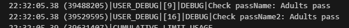
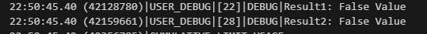

<!-- conditionalStatementsContinued.md -->
# EXPLORING THE "?" SYMBOL IN SALESFORCE APEX: THE TERNARY OPERATOR

---

### What is the ternary operator?

The ternary operator is a shorthand way of writing conditional statements in Apex. Instead of using an *if* statement with a block of code for each condition, we can use the ternary operator to write the same logic in a single line. 

Example using if-else statement:
```apex
Integer ageValue = 20;
String passName;

if(ageValue > 18){
  passName = 'Adults pass';
}else{
  passName = 'Kids pass';
}
System.debug('Check passName: ' + passName);

```


Example using the ternary operator:
```apex
Integer ageValue2 = 20;
String passName2;

passName2 = ageValue2>18?'Adults pass':'Kids pass';
System.debug('Check passName2: ' + passName2);

```


Syntax:
```apex
Boolean_expression ? expression_if_true : expression_if_false;
```

Parameter|Explanation|Example
---|---|---
Boolean_Expression|It is the logical check we want to perform and it is evaluated first to either true or false. If it's true, the expression_if_true is executed; otherwise the expreession_if_false is executed.|ageValue > 18<br><br>In the example we were checking whether ageValue is greater than 18 or not.
Expression_if_true|It is the expression that is executed if the Boolean_Expression is evaluated to true. The value of this expression execution is returned and can be assigned to a variable or usedd as part of another expression or method result|'Aduls Pass'<br><br>In the example, this expression was a simple fixed string.
Expression_if_false|It is the expression that is executed if the Boolean_Expression is evaluated to false. The value of this expression execution is returned and can be assigned to a variable or used as part of another expression or method result|'Kids Pass'<br><br>In the example, this expression was a simple fixed string.

<div align=center>The Ternary Operator Syntax Explanation</div>

### Tips for using Ternary Operator

Let's point some tips to keep in mind while using the ternary operator to keep our code readable and easy to maintain:

#### Keep the logic simnple

- The ternary operator is best suited for simple conditional statements. For more complex logic, it's better to use traditional *if-else* statements
- for example, the following *if-else* statements would be better suited to traditional *if-else* rather than ternary operators

```apex
if(Boolean_Expression1){
  // do something
} else if(Boolean_Expression2){
  // do something else
}else{
  // do something else if both Boolean_Expressions are false
}
```

#### Use ()s & be consistent

- Adding ()s around the condition can help make the code more readable and prevent unexpected behavior.
- Consistency is key when it comes to code readability and maintainability. If we choose to sue ()s with the ternary operator, we should make sure to communicate this to our team and ensure consistency throughout the codebase.

```apex
// Sample without ()s (not recommended)
Boolean boolVar1 = true;
Integer ageValue3 = 12;
String result1 = boolVar1 && ageValue3 > 15 ? 'True Value':'False Value';
System.debug('Result1: ' + result1);

// Sample with ()s (recommended)
Boolean boolVar2 = true;
Integer ageValue4 = 12;
String result2 = (boolVar2 && ageValue4 > 15) ? 'True Value':'False Value';
System.debug('Result2: ' + result2);

```


#### Avoid nesting

- While it is possible to nest ternary operators (and it looks cool and clever), it can quickly become difficult to read and maintain. It's generally a better idea to use *if-else* statements in those cases

```apex
// Sample of nested ternary operator (they work, but not recommended)
Integer x = 5;
Integer y = 9;
Integer z = 11;

String res = (x > y) ? ((x > z) ? 'x is the largest  number':'z is the largest number'):((y > z) ? 'y is the largest number':'z is the largest number');

System.debug('The result is: ' + res);

```


### General Tips

1. **Use descriptive variable names**: when declaring variables, using meaningful names that are self explanatory for the variable usage. For example, avoid using variable names such as x,y,z and try using names as ageValue, isActive, etc. (Notice  the camelCase used for variable names). This will make our code easier to read and understand.
2. **Use comments to explain our logic**: It is a good practice to add meaningful comments in our code to explain the logic we are implementing. These comments will be helpful for other developers and for our future selfs. If we write code and leave it for two months, and then come back to it for edits, we will thank ourselves for leaving the commented notes. 