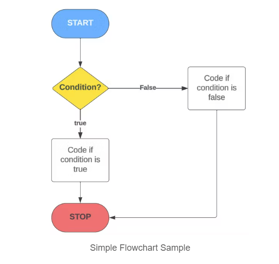
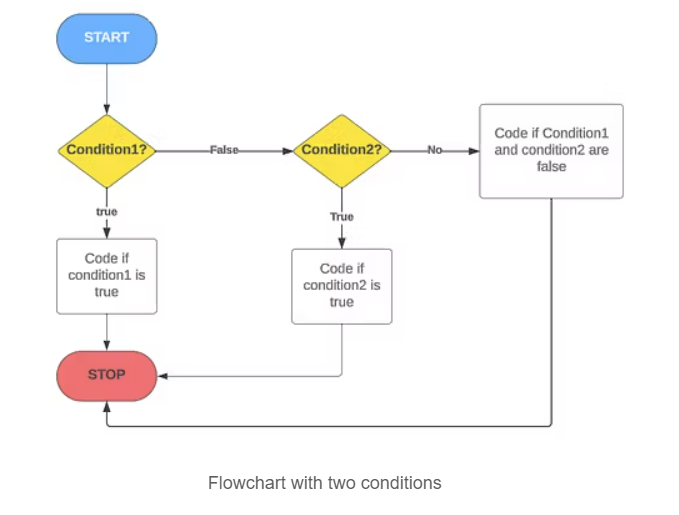
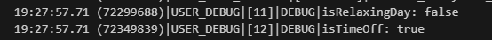
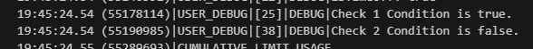

# INTRODUCTION TO CONDITIONAL STATEMENTS

---
## Introduction to Conditional Statements

- Conditional statements are fundamental to programming in Apex (or any other language)
- They allow us to make decisions and control the flow of code.
- We can think of them as the directions that guide our programming path.
- Resource Blogs used for the notes below:
  - [Beginner's Guide  to Salesforce Apex: Navigating Conditional Statemetns](https://codewithsally.com/salesforce-basics/beginners-guide-to-salesforce-apex-navigating-conditional-statements/)
  - [Exploring the "?" Symbol in Salesforce Apex: The Ternary Operator](https://codewithsally.com/apex/salesforce-apex-ternary-operator/)

So today we are going to look at conditional statements in Apex. They are a key type of control flow statement. Between this and the ternary statement we will control the path of our programming. 

## Visualizing Decision Paths with Flowcharts

The first step in visualizing how Apex handles decisions is reviewign and creating flowcharts. 
- our code asks a question (condition)
- and based on a 'yes' or 'no' answer (true or false), it decides which path to take. All of computer science is based on this simple concept. **'yes' or 'no', true or false, 0 or 1.**
  

## Understanding Conditions and Logical Operators

Before diving into the *if, else if, switch* statements, it's good to grasp the topic of conditions and logical operators in Apex.

### Simple Condition Example:
```apex
Boolean isSunny = true; // A basic condition set to true
```

### Logical Operators: Combining Conditions

Logical operators allow us to combine these basic conditions to form more complex statements. There are two primary logical operators we'll use:

AND (&&) | OR (\|\|)
--- | ---
This operator is used when we want **all combined conditions** to be true for the overall condition to be true. | Use this operator when we want **any one of the combined** conditions to be true for the overall condition to be true.
<div align=center>Logical Operators</div>

### Logical Operators Example:
```apex
Boolean isWeekend = true;
Boolean isHoliday = false;

// using and (&&)
Boolean isRelaxingDay = isWeekend && isHoliday; // evaluates to false

// Using or (||)
Boolean isTimeOff = isWeekend || isHoliday; // evaluates to true

// print our result
System.debug('isRelaxingDay: ' + isRelaxingDay);
System.debug('isTimeOff: ' + isTimeOff);
```


### The Importance of ()s in Logical Expressions

After getting comfy with conditions and logical operators, it's crucial to udnerstand how ()s ca impact the logic of our expressions in Apex.

()s in logical expressions determine the order of the operations, similar to their use in math. They are essential in complex conditions involving multiple logical operators as they ensure not only that our expressions are eval'd as intended but they make it more readable.

Without ()s | With ()s
--- | ---
In Apex, logical AND (&&) operators have higher precedence than OR (\|\|). Without  parens our conditions might not be evaluated in the order we expect | Using parens, we can explicitly define the order in which conditions are evaluated, making our logic clearer and preventing unintended results. 
<div align=center>Benefits of using ()s</div>

### Example Demonstrating Paren Usage

```apex
Boolean condition1 = true;
Boolean condition2 = true;
Boolean condition3 = false;

/*
Without parens, the condition is evaluated as follows:
  1. condition2(true) && condition3(false) first resulting in false
  2. condition1(true) || false resulting in true
*/
if(condition1 || condition2 && condition3){
  System.debug('Check 1 Condition is true.');
}else{
  System.debug('Check 1 Condition is fasle.');
}

/*
With parens, the condition is evaluated as follows:
  1. condition1(true) || condition2(true) first resulting in true
  2. true && condition3(false) resulting in false
*/
if((condition1 || condition2) && condition3){
  System.debug('Check 2 Condition is true.');
}else{
  System.debug('Check 2 Condition is false.');
}
```


### Understanding "if" Statements

The *if* statement is our bread and butter for decision-making in Apex. It allows our code to take different paths based on certain conditions.
- They are specially useful for **validating data**.

Syntax:
```apex
if(condition){
  // code to execute if condition is true
}
```

Example 1:
```apex
Integer score = 60;
if(score > 50){
  System.debug('You passed!');
}
```


Example 2:
```apex
Integer inputScore = 200; // if we choose value between 0 and 100 we get valid value
if(inputScore >= 0 && inputScore <=100){
  // process the score
  System.debug('Valid value');
}else{
  // show an error message
  System.debug('Invalid value');
}
```


### The Versatility of 'else if' and 'else'

When we have multiple conditions to check, *else if* comes into play. We can chain multiple *else if* statements after an *if*. And if non of the conditions are met, *else* catches everything else.

Syntax:
```apex
if(condition1){
  // code for condition1
}else if(condition2){
  // code for condition2
}else{
  // code if none of the conditions are met
}
```

Example 1:
```apex
Integer temp = 40;

if(temp < 20){
  System.debug('It\'s cold!');
}else if(temp < 30){
  System.debug('Nice Weather!');
}else{
  System.debug('It\'s hot!');
}
```


Example 2:
```apex
String userRole = 'Tester';

if(userRole == 'Admin'){
  System.debug('Welcome Admin');
}else if(userRole == 'User'){
  System.debug('Welcome User');
}else{
  System.debug('Hello Guest User');
}
```


### The Switch Statement: A neat alternative

The *switch* statement is a neat and organized way to handle multiple conditions, specially when dealing with known values like Enums or String.

Syntax
```apex
switch on expression{ // apex uses 'on' because there is already an object call 'case'
  when value1{
    // code for value1
  }
  when value2{
    // code for value2
  }
  when else{ // default block, optional
    // code if non of the other values are matched
  }
}
```
NOTES:
1. The expression can be of the following types:
    - Integer
    - Long
    - sObject (we'll cover this later)
    - String
    - Enum
2. The *when* value:
    - It can be a single value or multiple values (comma separated as per the exmaple)
    - Every *when* value in our code needs to be one-of-a-kind. For instance, if we use a value like *x*, it should only appear in a single *when* block. A *when* block will match a condition only once at most. 
    - The value can be null : when null{...}
3. *when else*
    - It is optional
    - If added, it must be the last block in the *switch* statement

Example:
```apex
String dayofWeek = 'Thursday';

switch on dayOfWeek{
  when 'Monday','Tuesday','Wednesday','Thursday','Friday'{
    System.debug('Weekday');
  }
  when 'Saturday','Sunday'{
    System.debug('Weekend!');
  }
  when else{
    System.debug('Invalid day');
  }
}
```


### A Quick Word on Ternary Operator

Although we'll cover the ternary operator later, here's a quick peek; It's basically just shorthand for *if-else* and its great for simple conditions (or assignments)

Format:
```apex
condition ? value_if_true : value_if_false;
```

Example:
```apex
Integer score2 = 49;
String result = score2 > 50 ? 'Pass' : 'Fail';
System.debug('Result: ' + result);

```


### Compoaring When to Use Each Type of Conditional
Conditional Statement|When to Use|Key Characteristics
---|---|---
if|We have a single condition to check|Simple and direct; evaluates a condition as true or false
else if|We have multiple conditions, but only one meets|Used after *if* statement; checks additional conditions
else|To handle the scenario when none of the *if* or *else if* conditions are met.|Provides a default path when no conditions are true.
switch|Handling multiple **known** values in an organized way.|Great for Enums and specific cases; cleaner than multiple *if-else* statements
Ternary|When we need a quick and simple conditional assignment or action|A concise alternative to *if-else*; format:<br>condition ? value_if_true : value_if_false

<div align=center>Choosing the Right Conditional Statement in Apex</div>