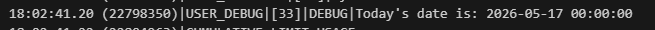
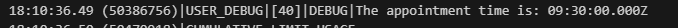
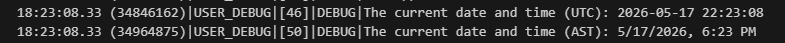

# Understanding Variables

## What are variables?

- Variables are a key concept that we'll use day-to-day in our coding.
- They are also very simple.
- Variables are like containers that hold different types  of information
- Check the blog: [Beginner's Guide to Salesforce Apex: Primitive Data Types and Methods](https://codewithsally.com/beginners-guide/salesforce-primitive-data-types-guide-beginners/)
- Variable names allow us to refer to specific pieces of data within our code

## Declaration vs Initialization
- Variable Declaration:
  - Declaring a variable  means creating a placeholder for data but it doesn't have a value just yet.
    -  `DataType variableName;` or `Integer noDays;`
    - The value of variables that aren't initialized is `null`

    ```apex
    // This is how we would declare a variable
    // Variable_Data_Type variableName;
    // 1. Variable_Data_Type: this would be the type of the variable we need (simple or complex)
    // 2. variableName: this would be the variable name that we will use to access the it in code

    // Examples:
    Integer studentAge; // variable of type Integer and name studentName
    Decimal averageMarks; // variable of type Decimal an dname averageMarks
    ```
- Variable Initialization:
  - Initializing a variable means creating a placeholder for data AND giving it an initial value.
    - `DataType variableName = defaultValue;` or `Integer noDays = 30;`

    ```apex
    Integer studentAge = 18; // variable of type integer, name studentName & default value of 18
    Decimal averageMarks = 22.3 // variable of type Decimal, name averageMarks, & default value of 22.3
    ```

Then we can
  - update its value in the code at any time
  - The new value must be of the same data type that was used to declare the variable

  ```apex
  Integer studentAge = 19;
  ...
  ...
  studentAge = 20; // change the studentAge value from 19 to 20 at some point in the code

  // Variable declaration only without initialization
  Decimal averageMarks;
  ...
  ...
  averageMarks = 22.7; // before that line averageMarks was null, we set its value to 22.7
  ```

# Understanding Data Types in Salesforce Apex

## Data types in sf Apex

- In sf apex, data types can be categorized into two main groups:
  - Primitive Data Types - holding a single value
  - Complex Data Types - anything more complicated (2 or more values, for example)

## Primitive Data Types

Each variable will have a specific data type. SF primitive data types represent basic, single values, such as numbers, strings, booleans, dates, and so on.


## DataType Methods in sf Apex

- What are data type methods?
  - Date type methods are like built-in functions that come with each data type (class).
  - They allow us to perform specific operations or tasks on data of that type.
- Why use data type methods?
  - These methods simplify coding tasks and save time.
  - They provide a standardized way to work with data of a particular type.

  ## Number Data Types

  - Integer, Long, Double and Decimal data types are used to store number values, either whole or decimal. For example: age, salary, total, and so on.

  #### Integer and Long Data Types:
  - Both Integer and Long data types are used to store whole numbers (no decimal points allowed).

  |Integer Data Type|Long Data Type|
  |---|---|
  |Smaller Range: -2,147,483,648 to 2,147,483,647|Larger Range: -9,,223,372,036,854,775,808 to 9,223,372,036,854,775,807|
  |Integer variables use less memory|Long Variables can store larger numbers|

  Examples:
  ```apex
  // declare an integer variable with anme intValue and initialize it with a whole number 10
  Integer intValue = 10;

  // declare a long variable with name longValue and intialize it with a whole number 1234567890
  // note that we have to put an 'L' after the whole number to indicate that it is treated as a Long
  Long longValue = 1234567890L;
  ```

  We must be careful with assigning really big numbers to a Long variable without using the 'L' character. If we don't use the 'L' character, we might get an error message that says 'illegal Integer'. So we'll always have to use the 'L' when working with Longs.

  ```apex
  // Exceeding the Integer range and not using 'L'
  Long longValue = 9223372036854775807;
  ```
  


  #### Double and Decimal Data Types
  - Both Double and Decimal data types are used to store decimal (floating point) numbers

  |Double Data Type|Decimal Data Type|
  |---|---|
  |It is like a ruler that measures length up to 15 decimal places|It is like a more precise ruler that measures length up to 18 decimal places|
  |It takes up less memory|It takes more memory|
  |it is faster to compute|It takes longer to compute|
  |It is a good choice fi we're working with large amounts of data or need to perform calculations quickly|It is a good choice if we need high accuracy or if we are working with financial data where even small errors can be a big deal|

  Note that there are subtle behavior differences when we assign 17 decimal points to the different types. 
  ```apex
  // decimal variable and printings value
  // 3.14159265358979396 has 17 decimal places
  Decimal decimalValue = 3.14159265358979396;
  System.debug('The Decimal Value of 3.14159265358979396 is: ' +decimalValue);

  // double variable  and print its value
  // 3.14159265358979396 has the same 17 decimal points
  Double doubleValue = 3.14159265358979396;
  System.debug('The Double Value of 3.14159265358979396 is: ' +doubleValue);
  ```
  

  - The decimal data type printed the number as it is, without rounding it
  - The double data type rounded the number to the closest approximation that an be presented using 15 decimal places.
  So if we want precision we use Decimal.

  ## Text Type (string)

  String is a data type that represents a swequence of characters, such as a word, phrase, or sentence.
  We can include numbers in our string as well. 

  - A String is a data type that represents a sequence of characters, such as:
    - a word
    - a sentence
  - We can include numbers in our string as well

  - String values are enclosed in single quotes (''):
  ```apex
  String welcomeText = 'Hello, coding crew, to my blog # 2!';
  ```

  - We can use concatenation with '+' to combine multiple strings and/or variables in one single variable.
  ```apex
  String firstName = 'Kevin';
  String lastName = 'Ladoblanco';
  String welcomeNote = 'Welcome to my house: ' + firstName + ' ' + lastName;
  System.debug('Welcome Note Value: ' + welcomeNote);
  ```


## Boolean Type (Boolean)

Boolean type is a data type that has only two possible values: 
- true 
- or false
- commonly used in programming to make decisions with conditional statements

```apex
// compare if 3 is bigger than 2
// and return true or fasle in isThreeBigger
Boolean isThreeBigger = 3 > 2;
System.debug('isThreeBigger value: ' + isThreeBigger);

// check that firstName is equal to lastName
// and return true or false in isEqualvalue
String firstName = 'Kevin';
String lastName = 'Whiteside';
Boolean isEqualValue = firstName == lastName;
System.debug('isEqualValue value: ' + isEqualValue);
```


## Date Types 
Date, Time, DateTime data types are used to represent date-related values, either as a date, time, or date/time.

## Date

Date data type represents a date without a time counterpart. It can be used to represent dates such as birthdays, deadlines, or other data that includes only a date where we don't care about the time. Good to note that the result still shows the '00:00:00' for the time, so might have to use some string manipulation if I don't want that later.

```apex
// we declare a variable of tyep Date, give it anme todaysDate
// Initialize the date var with today's date
// Date.today() is one of the methods available to use with the Date data type
Date todaysDate = Date.today();
System.debug('Today\'s date is: ' + todaysDate);
```


## Time

Time data type represents a specific time of day without a date component. It would be useful when calculating the duration of an event like a meeting. Again, there will be some string manipulation needed if just needing a normal looking time for something. 🤔 I wonder if as a type, apex reads and works with these values as it should?

```apex
// declare a var of type Time and give it a name of customTime
// initialize it using newInstance
// newInstance is a method available for the Time class
// newInstance parameters (Integer hour, Integer minutes, Integer seconds, Integer milliseconds)
Time customTime = Time.newInstance(9,30,0,0);
System.debug('The appointment time is: ' + customeTime);
```


## DateTime

DateTime data type represents both a date and a time value.
- DateTime can be used to represent events, transactions, meeting start date/time, or other data that includes both a date and time component.
- It's important to remember that all DateTime values are stored in the UTC (Coordinated Universal Time) time zone.
  - This means that if we create a new DateTime value in Apex, it will be automatically converted to UTC time and stored in the database. (is that just datetime, what about Time separately? 🤔 I assume so, but according to Gemini: *In Apex, the Time type inherently represents a fixed time of day (hours, minutes, seconds, milliseconds) and does not have a time zone offset. It behaves as though it is in UTC/GMT because it contains no date or zone information, whereas DateTime strictly includes date, time, and a specific time zone*)
  - The code sample below is an example where DateTime will be printed on the screen in UTC format by default and we have to use the format() method to adjust it to our local timezone.

```apex
// DateTime.now() is one of the methods available  to use with the DateTime type
DateTime currentDateTime = DateTime.now();

// this debug statement will print the date time in default UTC format
System.debug('The current date and time (UTC): ' + currentDateTime);

// This debug statement will display the time in my current time zone using format()
// It converts the date to the local time zone
System.debug('The current date and time (AST): ' + currentDateTime.format());
```



## ID Type (ID)

The ID data type is used to represent the unique identifier of a record. So from what I'm learned so far, this would be the 'Name' field when creating a new object. That first field that maps to the Primary Key of a rdbms. In the SF database which we usually refer to as the 'record Id' as well. 

The record Id is generated for us when we create a record for any type (if we set it to Auto ID or leave it as Text). This value can't be changed. Interestingly I just realized 💡that when we set that field and it has the option 'Auto Number' or 'Text', it still going to be the PK as normal, but it'll be an actual number or that 18 digit string that sf adds to things. I'll confirm if my thinking is correct there later 🤔

```apex
// let's declare a var for Account data type and set the name field. First time doing this
// programatically
Account accountCodeWithSally = new Account(Name='Code With Sally');

// now we insert the account with some DML
insert accountCodeWithSally;

// now we declare a var of data type ID, and give it a name codeWithSallyID
// then initialize the id var with the account record ID we just created
ID codeWithSallyID = accountCodeWithSally.Id;

// then we print it
System.debug('The ID of Code With Sally account is; ' + codeWithSallyID);
```

## Primitive Date Type Methods

In SF, each primitive data type (such as Integer, Double, String, DateTime, etc.) is actually a special "class" that comes with its own set of built-in methods that can be used to do different things with the data. These methods are like special tools that allow us to manipulate or calculate the data in various ways.

Here is a brief sample of some of the more important ones. It's important to note that there are many more methods available for each data type that can be useful for specific programming needs. 

DATA TYPE|METHOD & USAGE|SAMPLE
---|---|---
Integer|<b>valueOf(StringValue)</b><br><br>Returns an Integer that contains the value of the specified string passed.|Integer intValue = Integer.valueOf('567');
Decimal|<b>intValue()</b><br><br>Returns the integer value of the decimal|Decimal decimalValue = 3.456;<br>System.debug('Value: ' + decimalValue.intValue());<br><br><b>Output</b>: 3
Decimal|<b>round()</b><br>Returns a long value. The value returned will be a rounded number to zero decimal places.<br><br>The rounding mode is 'half-even' which means any number will be rounded to the closest nearest neighbor and if the number has .5, the number will be rounded to the closest even neighbor. 🤔🤔🤔|Decimal decimalValue1 = 8.5;<br>System.debug('Value: ' + decimalValue1.round());<br><b>Output</b>: 8 (closest even)<br><br>Decimal decimalValue2 = 3.5;<br>System.debug('Value: ' + decimalValue2.round());<br><b>Output</b>: 4 (closest even)<br><br>Decimal decimalValue3 = 8.7;<br>System.debug('Value: ' + decimalValue3.round());<br><b>Output</b>: 9 (closest)
Date|<b>addDays(NoDays)</b><br><b>addMonths(NoMonth)</b><br><b>addYears(noYears)</b><br><br>These methods return a Date value and their purpose is to add 'X' number of days, 'X' number of months, or 'X' number of years to a specific date variable|Date todayDate = Date.Today();<br>Date tomorrowDate = todayDate.addDays(1);<br>System.debug('Tommorrow: ' + tomorrowDate);<br><br><b>If Today was 12 April 2023</b><br><b>Output</b>: Tomorrow: 2023-04-13 00:00:00
String|<b>toLowerCase()</b><br><b>toUpperCase()</b><br><br>Returns a String value with all characters lower or upper cased.|String helloText = 'Hello Coding Crew!';<br><br>System.debug('Lower: ' + helloText.toLowerCase());<br><b>Output</b>: Lower: hello coding crew!<br><br>System.debug('Capital: ' + helloText.toUpperCase());<br><b>Output</b>: Capital: HELLO CODING CREW!
String|<b>trim()</b><br><br>Returns a copy of the string without any leading or trailing white space characters.|String helloText = '   Hello Coding Crew!  ';<br><br>System.debug('Text: ' + helloText().trim());<br><b>Output</b>: 'Text: Hello Coding Crew!'
String|<b>contains(substring)</b><br>Returns true if the string calling the contains method has the substring parameter|String helloText = 'Hello Coding Crew!';<br>System.debug('Value: ' + helloText.contains('Crew'));<br><br><b>Output</b>: Value: True
String|<b>removeEnd(substring)</b><br><b>removeStart<substring></b><br><br>The 'removeEnd' method removes the specified substring value from the end of a String, while the 'removeStart' method removes it from the beginning of a string|String helloText = 'Test Hello Coding Crew! Test';<br><br>System.debug('Start: ' + helloText.removeStart('Test'));<br><b>Output</b>: Start: Hello Coding Crew! Test<br><br>System.debug('End: ' + helloText.removeEnd('Test'));<br><b>Output</b>: End: Test Hello Coding Crew!

<div align=center>Sample Table of Available Data Type Methods in sf Apex Code</div>
