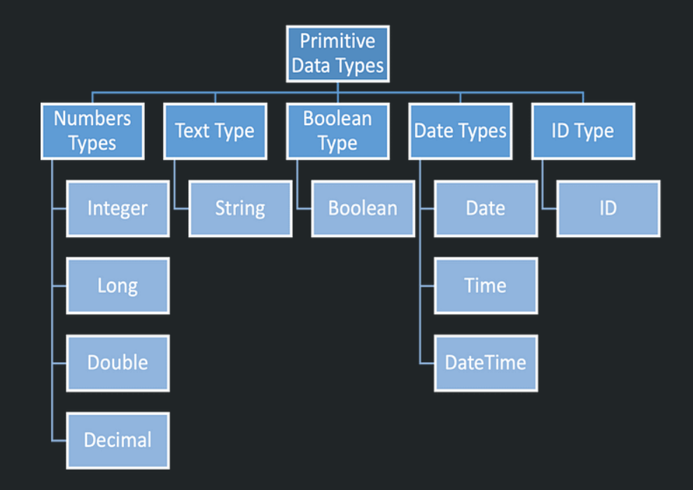
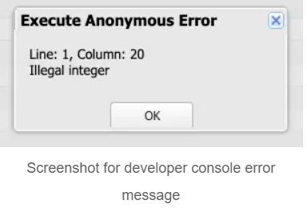
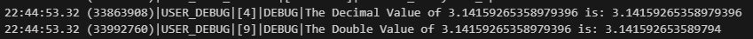
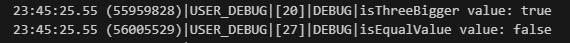

# Understanding Variables

## What are variables?

- Variables are a key concept that we'll use day-to-day in our coding.
- They are also very simple.
- Variables are like containers that hold different types  of information
- Check the blog: [Beginner's Guide to Salesforce Apex: Primitive Data Types and Methods](https://codewithsally.com/beginners-guide/salesforce-primitive-data-types-guide-beginners/)
- Variable names allow us to refer to specific pieces of data within our code

## Declaration vs Initialization
- Variable Declaration:
  - Declaring a variable  means creating a placeholder for data but it doesn't have a value just yet.
    -  `DataType variableName;` or `Integer noDays;`
    - The value of variables that aren't initialized is `null`

    ```apex
    // This is how we would declare a variable
    // Variable_Data_Type variableName;
    // 1. Variable_Data_Type: this would be the type of the variable we need (simple or complex)
    // 2. variableName: this would be the variable name that we will use to access the it in code

    // Examples:
    Integer studentAge; // variable of type Integer and name studentName
    Decimal averageMarks; // variable of type Decimal an dname averageMarks
    ```
- Variable Initialization:
  - Initializing a variable means creating a placeholder for data AND giving it an initial value.
    - `DataType variableName = defaultValue;` or `Integer noDays = 30;`

    ```apex
    Integer studentAge = 18; // variable of type integer, name studentName & default value of 18
    Decimal averageMarks = 22.3 // variable of type Decimal, name averageMarks, & default value of 22.3
    ```

Then we can
  - update its value in the code at any time
  - The new value must be of the same data type that was used to declare the variable

  ```apex
  Integer studentAge = 19;
  ...
  ...
  studentAge = 20; // change the studentAge value from 19 to 20 at some point in the code

  // Variable declaration only without initialization
  Decimal averageMarks;
  ...
  ...
  averageMarks = 22.7; // before that line averageMarks was null, we set its value to 22.7
  ```

# Understanding Data Types in Salesforce Apex

## Data types in sf Apex

- In sf apex, data types can be categorized into two main groups:
  - Primitive Data Types - holding a single value
  - Complex Data Types - anything more complicated (2 or more values, for example)

## Primitive Data Types

Each variable will have a specific data type. SF primitive data types represent basic, single values, such as numbers, strings, booleans, dates, and so on.



## DataType Methods in sf Apex

- What are data type methods?
  - Date type methods are like built-in functions that come with each data type (class).
  - They allow us to perform specific operations or tasks on data of that type.
- Why use data type methods?
  - These methods simplify coding tasks and save time.
  - They provide a standardized way to work with data of a particular type.

  ## Number Data Types

  - Integer, Long, Double and Decimal data types are used to store number values, either whole or decimal. For example: age, salary, total, and so on.

  #### Integer and Long Data Types:
  - Both Integer and Long data types are used to store whole numbers (no decimal points allowed).

  |Integer Data Type|Long Data Type|
  |---|---|
  |Smaller Range: -2,147,483,648 to 2,147,483,647|Larger Range: -9,,223,372,036,854,775,808 to 9,223,372,036,854,775,807|
  |Integer variables use less memory|Long Variables can store larger numbers|

  Examples:
  ```apex
  // declare an integer variable with anme intValue and initialize it with a whole number 10
  Integer intValue = 10;

  // declare a long variable with name longValue and intialize it with a whole number 1234567890
  // note that we have to put an 'L' after the whole number to indicate that it is treated as a Long
  Long longValue = 1234567890L;
  ```

  We must be careful with assigning really big numbers to a Long variable without using the 'L' character. If we don't use the 'L' character, we might get an error message that says 'illegal Integer'. So we'll always have to use the 'L' when working with Longs.

  ```apex
  // Exceeding the Integer range and not using 'L'
  Long longValue = 9223372036854775807;
  ```
  


  #### Double and Decimal Data Types
  - Both Double and Decimal data types are used to store decimal (floating point) numbers

  |Double Data Type|Decimal Data Type|
  |---|---|
  |It is like a ruler that measures length up to 15 decimal places|It is like a more precise ruler that measures length up to 18 decimal places|
  |It takes up less memory|It takes more memory|
  |it is faster to compute|It takes longer to compute|
  |It is a good choice fi we're working with large amounts of data or need to perform calculations quickly|It is a good choice if we need high accuracy or if we are working with financial data where even small errors can be a big deal|

  Note that there are subtle behavior differences when we assign 17 decimal points to the different types. 
  ```apex
  // decimal variable and printings value
  // 3.14159265358979396 has 17 decimal places
  Decimal decimalValue = 3.14159265358979396;
  System.debug('The Decimal Value of 3.14159265358979396 is: ' +decimalValue);

  // double variable  and print its value
  // 3.14159265358979396 has the same 17 decimal points
  Double doubleValue = 3.14159265358979396;
  System.debug('The Double Value of 3.14159265358979396 is: ' +doubleValue);
  ```
  

  - The decimal data type printed the number as it is, without rounding it
  - The double data type rounded the number to the closest approximation that an be presented using 15 decimal places.
  So if we want precision we use Decimal.

  ## Text Type (string)

  String is a data type that represents a swequence of characters, such as a word, phrase, or sentence.
  We can include numbers in our string as well. 

  - String values are enclosed in single quotes (''):
  ```apex
  String welcomeText = 'Hello, coding crew, to my blog # 2!';
  ```

  - We can use concatenation with '+' to combine multiple strings and/or variables in one single variable.
  ```apex
  String firstName = 'Kevin';
  String lastName = 'Ladoblanco';
  String welcomeNote = 'Welcome to my house: ' + firstName + ' ' + lastName;
  System.debug('Welcome Note Value: ' + welcomeNote);
  ```


## Boolean Type (Boolean)

Boolean type is a data type that has only two possible values: true or false
- commonly used in programming to make decisions with conditional statements

```apex
// compare if 3 is bigger than 2
// and return true or fasle in isThreeBigger
Boolean isThreeBigger = 3 > 2;
System.debug('isThreeBigger value: ' + isThreeBigger);

// check that firstName is equal to lastName
// and return true or false in isEqualvalue
String firstName = 'Kevin';
String lastName = 'Whiteside';
Boolean isEqualValue = firstName == lastName;
System.debug('isEqualValue value: ' + isEqualValue);
```



