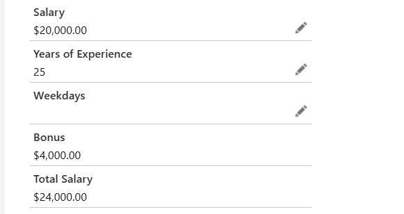
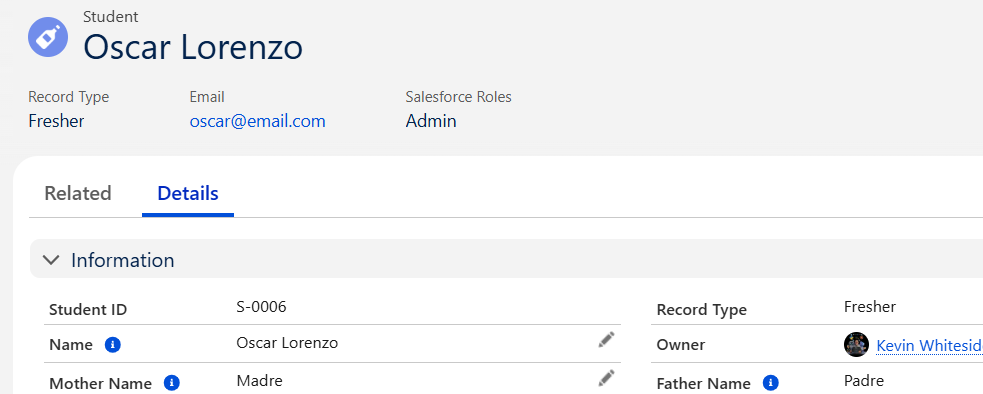

# Day 04 | SF Learning Bootcamp 2023

## Formula & Validation Rules, Page Layout & Record Type, Compound Layout

---
### Formula Field
- Read only field which derives its value based on a formula expression you define. 
- The formula field is updated when any of the source fields change.
  - Scenario 1 could be calculating a  bonus: If salary > 10000 then 20% else 10%
    - Return data type is currency: Calculate a dollar or other currency amount and automatically format the field as a currency amount.
    - If you formula references any number, currency, or percent fields, you must specify what happens to the formula output when their values are blank.
  - Scenario 2 could be calculating total salary of an instructor
  

### Validation Rule
- I define a validation rule by specifying an error condition and a corresponding error message.
  - **I must ensure to place the rule on the correct object (easy miss).**
- The error condition is written as a Boolean formula expression that returns *true* or *false*.
- When the formula expression returns **true**, the save will be **aborted** and the error message will be displayed. 
- The user can correct the error and try again.
- The error message can either appear at the top of the page or below a specific field on that page.
  - Display the message next to the field that the user should correct. *If my rule checks several fields, then display the error at the top of the page.*

- **Scenarios:**
  - Scenario 1: Student's age shoudl be > 0.
  - Scenario 2: Instructor rating should be between 1 to 5.
  - Scenario 3: Student's entrance score should not be blank.

### Page Layout
- Allows me to create new sections to the page layout and then drag and drop the fields to each section in the order that I determine
  - When creating the fields I remember the last step is to add the field to a layout. This means that on Object creation there is a **default layout** already created. Therefore when we create other layouts (creation or cloning), the result is at least 2 or more layouts in our list. 
- Most times we will be *cloning* a current layout and making slight changes
- We can also change the fields to *read-only* or *required* through the  page layout configuration as well. 
- I can then determine with layout is loaded depending on the user with **Record Type**

### Record Type
- **Controls** page layouts and Picklist values.
- The new record type will include all of the picklist values from the existing record type selected (if this is the first record type it will be the *Master*). 
- After saving the new record type, I will be able to customize the picklist values.
- I then make them available to different users based on their profile, making it available for editing by the user or their default. 
- If no record type is creataed then all records will use the *master* or *default* record type. 
- After you create a new record type I can then go through and change them over one by one, or by placing the new *RECORD TYPE* (automatically created on the page layout screen), on the object detail page, I'll have that *Change Record Type* option right on the detail page to switch.
- **IMPORTANT: Validation rules are overarching on record types. This means that if certain record types don't include certain fields that have a validation rule, I'll get an error. Therefore I need to add a *Record Check* to that validation rule as well**

### Compact Layout
- Compact layouts are used in the mobile app and some Chatter feed items to display a record's key fields at a glance. 
- I can select and prioritize up to ten fields for the compact layout, but that number of fields that display may vary depending on device's screen, which record page is being viewed, and the permissions of the user. 
- As seen below, the *compact layout* will show at the type of the record. Below we see the name (Oscar Lorenzo), Record Type (Fresher), Email and Salesforce Role

