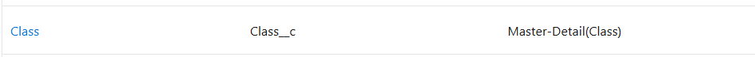
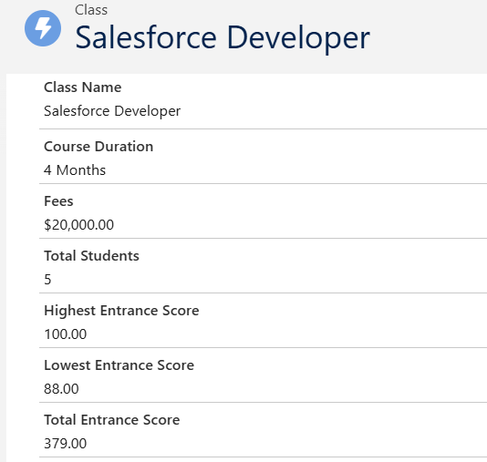
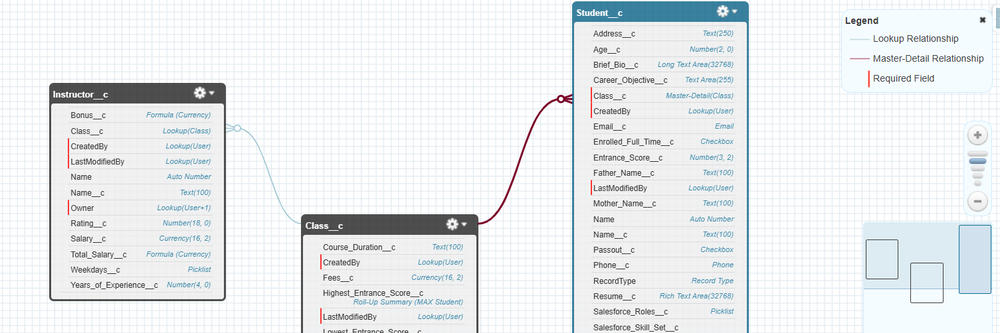
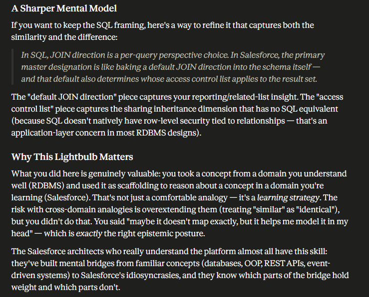
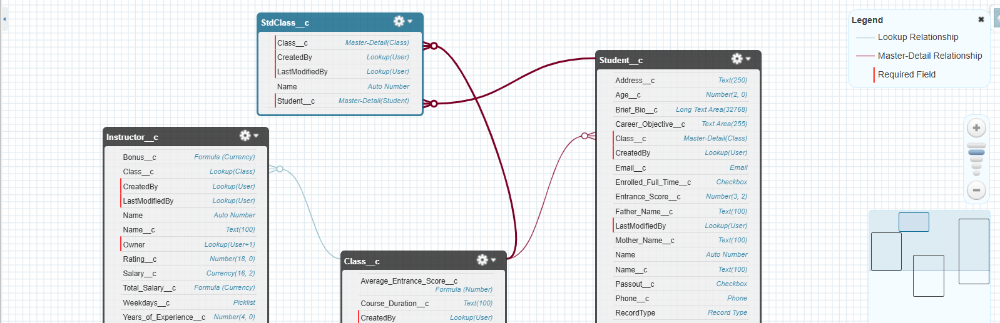

# Day 05 | SF Learning Bootcamp 2023

## Lookup & Master-Detail Field Relationships, Rollup Summaries, and Junction Objects (Tables)
---
### Relationships - 1:many & many:many

#### One to Many Relationship

- **Lookup relationship**
  - Creates a relationship that links one object (table) to another object. In my rdbms mental model this is the **Soft Foreign Key**. Creating a 1:many relationship that can be null and has no cascading deletion. 
  - The relationship field allows users to click on a lookup icon to select a value from a popup list.
  - The other is the source of the values in the list.
  - The fact that the field can be null and there is no cascading deletion means that they are *Loosely Coupled Relationships*.
  - **NOTE:** The relationship field must be put on the **child object (table)** object looking up to the **parent object (table)** object. For example:
      Class --> Parent; Here we will see *Related List* on the object
      Student --> Child; Lookup Field added to it, looking up to Class.
  - **Child Relationship Name** is an internal reference (apex/api) and is used for integration purposes. I must be careful when changing the Child Relationship Name as it may affect existing integrations.
  - **Required** makes this field required in order to save the record (row). Its like making something NOT NULL in a rdbms. 
  - **What to do if the lookup record is deleted? (Blank or don't allow Parent to be deleted)** also configures in sf what would be in a rdbms the same as adding cascading deletion. I can't choose Blank option if I've made the field required. 🤔 (strange since a MD relationship is alrady BOTH Non Null and cascading deletion; but it looks like this is this way in order to be maintain it as a LookUp, but have some of the MD protections).
    - If I want Not Null and Cascading Delete, then just use MD
    - If I need it to be loosely coupled (i.e., allow different owners as MD trickles ownership down) then I can use Lookup with the Not Null, Cascade Delete option
  - **Auto add to custom report type** adds this field to existing custom reporting that contain this entity.
  - The name of the newly created field will be the parent object. Just like you would create a *table_id* column in a database. But instead of creating *class_id* we just have *class* as the column (field) name.
- **Master-Detail Relationship**
  - Creates a special type of parent-child relationship (still 1:many) between two objects (tables)
  - One is known as child/detail where I create the MD relationship field and the other is known as the parent/master.
    - Required on all detail (child) records. The mental model is the NOT NULL with CASCADE DELETE in an rdbms 
    - Ownership and sharing of detail record is determined by the master (as I commented above as to why the flexibility of having NOT NULL & CASCADE DELETE in a normal Lookup Relationship)
    - If user deletes the master record then all detail records are deleted (this is the CASCADE DELETE in an rdbms)
    - I can create a Rollup Summary field on the master record so that detail records can be summarized
    - This is a *Tightly Coupled Relationshp* as one is completely dependent on the other.
  - I can't create a MD  relationship on an existing custom object if records already exist. If this is the case, I can:
    - create Lookup Relationship
    - populate the lookup field with data in all records
    - then change the relationship type to MD (which is what I did for Class)
    

  - Rollup Summary Field (MD Feature)
    - A read-only field that displays the sum, min, or max value of a field in a related list.
      - Note that rollups can only do *sum, min, or max*. Anything thing else will need to be done with a workaround, more than likely with a Formula Field on the Master object
    - This field can also count all records available in related list.
    - Rollup Summary fields are **always** created on the parent (master) object.
    - Filters on rollup summaries can only natively use *AND* for multiple criteria filters. The work-around if we need something more complex or need to use *OR* is to use a Formula field on the detail (child) object. (Per Claude: *"For your Admin cert purposes, the key thing to know is that the native roll-up filter only supports AND, and the formula field workaround is the standard declarative solution when OR logic is needed. That's exactly the kind of limitation-plus-workaround combo that shows up on the exam."*)
      - **Formula Field on Detail Object Work-around:** Create a checkbox formula field on the child object that evaluates our OR condition and returns true/false. Then use that single checkbox as our roll-up criteria. So we are essentially pre-computing the OR logic one level down, then rolling up based on that result.
    
  - I can convert a Lookup field to an MD field as long as I don't have any empty records for that field. Meaning that if I convert based on Class, then all of my records (previously created) must have a class (parent) assigned, otherwise I'll get an error. 
  - I can also convert an MD to a Lookup, but I must first delete any Rollup Summaries related to that child (detail) object from both the object and the Recycle bin ("Deleted Fields")

    [Considerations for Object Relationships](https://help.salesforce.com/s/articleView?id=platform.relationships_considerations.htm&type=5)
  - We can see all of these relationships graphically in Schema Builder
    - One to many:
    

#### Many to Many Relationships with Junction Objects (Junction Tables in RDBMS)

- This is accomplished with Junction (bridge) objects which map to Junction Tables in the rdbms universe
  - First create the junction object as a custom object for your application
  - Then create 2 MD relationship fields on that junction object pointing to the 2 parents for our many to many relationship
    - **NOTE**: This is why we can have no more than **2** MD relationships on any object. Its to allow for the creation of junction objects, which can only have 2 parents, no more. Salesforce  org  will not allow you to put more than 2 MD fields on any object. 
    - *After creating it in the  org, my mental model based on the rdbms makes much more sense now. Its much clearer 🤯🤯🤓🤓🤓*
  - Then we customize the related lists on the page layouts of the two Master objects
    - For a many:many relationship in SF each master object record displays a *related list* of the associated junction object records. To create a seamless user experience, I can change the name of the junction object related list on each of the master object page layouts to have the name of the other master object. For exaample, I can change the StdClasses related list to Students on the Classes page layout and to Classes on the Students page layout. I can then further customize these related lists to display fields from the other master object. 
  - Then finally customze reports to maximize the effectiveness of the many to many relationship:
    - Many-to-many relationships provide two standard report types that join the master objects and their junction object:
      - *"Primary master with junction object and secondary master"* in the primary master object's report category.
      - *"Secondary master with junction object and primary master"* in the secondary master object's report category.
      - This is why the order of the master objects in the report type (and on the junction object itself) is important. The master object listed first determines the scope of records that can be displayed in the report. (🤔 Kinda like a Left Join in RDBMS?)
        - In rdbms the order doesn't matter at all. In SF it does, but not for the data reasons (according to Claude).  *It matters for platform behavior reasons. This is the key distinction. The first Master-Detail you create on a junction becomes the primary master, and that designation drives several platform features that don't exist in a raw RDBMS*
          - **Record ownership and sharing:** Junction records don't have their own owner. They inherit from their *primary* master. So if I make Class the primary master, all junction records inherit Class's sharing rules. And if we flip it then that also flips. This can completely change who can see what (which is VERY KEY IN SF)
          - **Look and feel:** When the parent is deleted and cascades to delete the records, the junction is shown as "deleted with primary master" in the recycle bin (Deleted Fields) context.
          - **Report record type and color:** In reports, as noted below, the junction's primary master is treated as the dominant lookup (the Left Join in rdbms).
          - **Default related list ordering:** The junction appears more prominently under the primary master's page layout.
      - In relationship to my mental model I clarifed the following with Claude. Too much to type:
      
      - I can create custom reports based on these standard report types. In addition, I can create report types to customize which related objects are joined in the report. 
    
    [Create a Many-to-Many Object Relationship](https://help.salesforce.com/s/articleView?id=platform.relationships_manytomany.htm&type=5)

